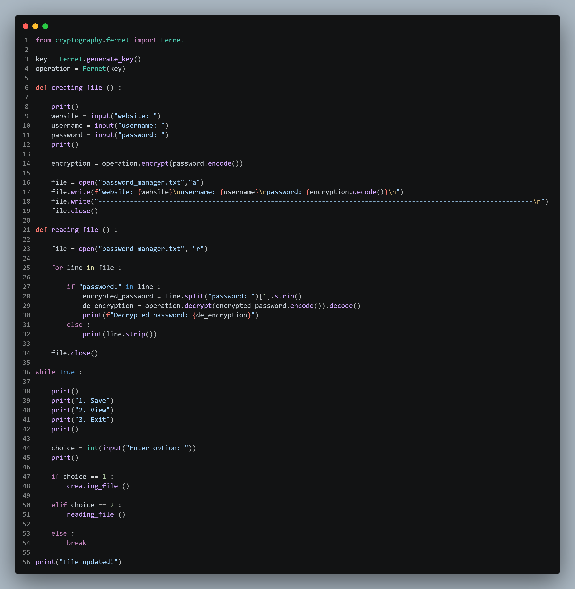

# Password Encryption Manager

A Python project that encrypts passwords securely using the `cryptography` library and Fernet encryption.

---
## Screenshot

## Features
- Encrypts passwords securely
- Stores website, username, and password information
- Uses Fernet symmetric encryption
- Beginner-friendly Python project
- Simple command-line interface

---

## Technologies Used
- Python
- Cryptography Library (`Fernet`)

---

## How It Works
1. The user enters:
   - Website
   - Username
   - Password

2. The password is encrypted using Fernet encryption.

3. The encrypted data is stored securely inside a file.

---

## Author
Abdullatif Traisi
